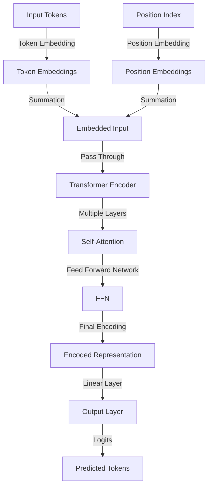
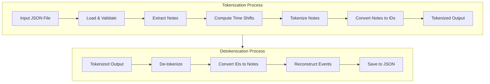
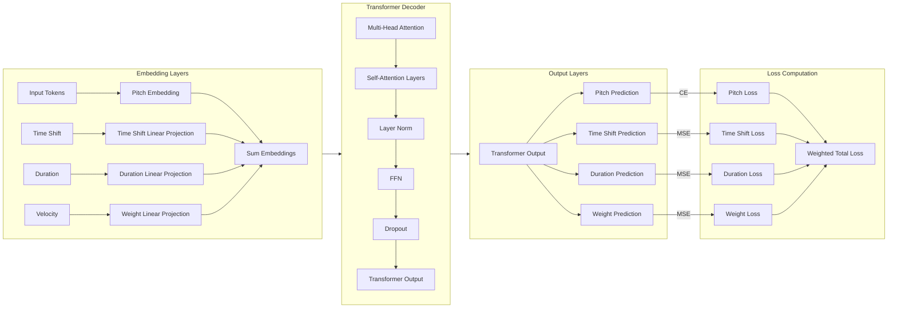
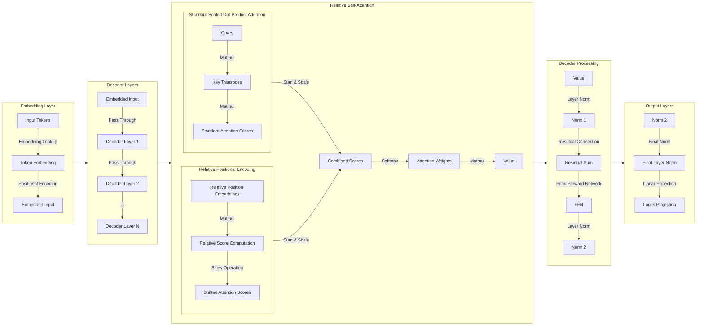

---
# You can also start simply with 'default'
theme: seriph
background: "public/images/cover.webp"
# some information about your slides (markdown enabled)
title: "PianoGen: Generacion de Musica de Piano con IA"
info: |
  ## Slidev Starter Template
  Presentation slides for developers.

  Learn more at [Sli.dev](https://sli.dev)
# apply unocss classes to the current slide
class: text-center
# https://sli.dev/features/drawing
drawings:
  persist: false
# slide transition: https://sli.dev/guide/animations.html#slide-transitions
transition: slide-left
mdc: true
setup:
  import MidiPlayer from 'components/MidiPlayer.vue'
  import 'setup/main.js'
---


<!-- Your slide content

<!-- <MidiPlayer midi-path="saved_outputs/v2/v2-best.mid" /> -->
<!-- <MidiPlayer midi-path="saved_outputs/v3/v3-try3-more-training.mid" /> -->

<!-- # Hi -->

<!-- For half size -->
<!-- <MidiPlayer midi-path="your-midi-file.mid" height="35vh" /> -->
<!-- --- -->
<!-- --- -->


# PianoGen: Generacion de Musica de Piano con IA
Aplicando Transformers.

<div class="abs-br m-6 text-xl">
  <a href="https://github.com/MightyHelper/pianogen" target="_blank" class="slidev-icon-btn">
    <carbon:logo-github />
  </a>
</div>


<!--
The last comment block of each slide will be treated as slide notes. It will be visible and editable in Presenter Mode along with the slide. [Read more in the docs](https://sli.dev/guide/syntax.html#notes)
-->

---
---
<Toc maxDepth=1 />
<!-- TODO: Split image layout -->

---
---

# Qué es una canción?

<!-- TODO: piano roll image -->

---
transition: fade-out
title: "Resumen: MIDI"
---

# Resumen: MIDI

<v-clicks>

- 🎵 **Mensajes de Nota** – Eventos de nota-on/off, tono, velocidad, duración.  
- 🎚️ **Mensajes de Control Change (CC)** – Ajusta volumen, modulación, expresión.  
- 🎛️ **Cambio de Programa** – Cambia sonidos o patches de instrumento.  
- ⏳ **Tiempo & Sincronización** – Tempo, firmas de tiempo, sincronización.  
- 🔧 **Mensajes de Sistema** – Metadatos, posición de la canción, datos SysEx.  

</v-clicks>

<!-- <center> -->

{width=65%}

<!-- </center> -->

---
---
# Datasets
<v-clicks>

- Custom
- Maestro
- JSB
- Lakh?

</v-clicks>

---
---
## Ejemplo Maestro

<MidiPlayer midi-path="saved_outputs/maestro_samples/MIDI-Unprocessed_R1_D1-1-8_mid--AUDIO-from_mp3_01_R1_2015_wav--5.midi" />

---
---
## Ejemplo custom

<MidiPlayer midi-path="saved_outputs/custom_samples/midi_undefined_1715486929603.mid" />
---
---

## Ejemplo JSB

<MidiPlayer midi-path="saved_outputs/jsb_samples/000000.mid" />
---
---

## Comparación de tamaño de datasets

<!-- <center> -->

{border=rounded}

<!-- </center> -->

---
---
## Comparación de uso de notas

<!-- <center> -->

{width=85%, border=rounded}

<!-- </center> -->

---
---
## Comparación de duración de notas

<!-- <center> -->

{border=rounded}

<!-- </center> -->

---
title: Tokenización
---
# Tokenización
Cómo tokenizamos musica?
<!-- TODO: Image piano roll + Arrow + token ids + question mark -->

<v-clicks depth=2>

- MidiTok (REMI) 
  - 
- CrayKH (Texto)
  - 

</v-clicks>

---
---
# Tokenización
<v-clicks depth=2>

- JSB
  - 
- Tokenización continua?

</v-clicks>

---
title: TransformerModel Architecture
layout: two-cols-header

---

# Primeros experimentos
<!-- TODO: Explain TFModel and it's shortcomings -->
<!-- Explain that training did not give good results. No need to listen - show empty piano roll -->
::left::

<Transform :scale=0.4>



</Transform>


::right::

<v-clicks>

- Tokenizador: `REMI`
- Arquitectura transformer básica
- Encoder-only
- ```yaml
  vocab_size: 3000
  embed_size: 512
  num_heads: 8
  num_layers: 6
  ff_hidden_size: 2048
  max_seq_length: 512
  dropout: 0.1
  ```
- No tuvo muy buenos resultados
- Complejidad del tokenizador?

</v-clicks>

---
---

# V2

<v-clicks>

<!-- Explain the ehnanced tokenization. Why BPE is not good. -->
<!-- Show result after 30 minutes of training -->
<!-- saved_outputs/v2/v2-best.mid -->

- Mismo modelo que V1
- Tokenizador sin BPE
- Resultados con 30 minutos de entrenamiento; loss = 0.01
- <MidiPlayer midi-path="saved_outputs/v2/v2-best.mid" height=35vh />

</v-clicks>

---
---
# V3

<!-- Explain why experiment with GPT-2 -->
<!-- Talk about HF Trainer API -->
<!-- Talk about overfitting and dataset contamination -->

<v-clicks>

- Modelo GPT-2
- Loop de entrenamiento con HF Trainer API
- Pre-Chunking para batching
- Overfitting y contaminación del dataset!
</v-clicks>
<v-switch unmount=true>
  <template #1 > <MidiPlayer midi-path="saved_outputs/v3/v3-try-1.mid" height=30vh /> </template>
  <template #2 > <MidiPlayer midi-path="saved_outputs/v3/v3-try-2-more-train.mid" height=30vh /> </template>
  <template #3 > <MidiPlayer midi-path="saved_outputs/v3/v3-try3-more-training.mid" height=30vh /> </template>
</v-switch>
---
---

# V4
<!-- Experimented with different datasets, multiple training resumes from checkpoints -->

<!-- Show some of the results -->

- Denuevo con GPT-2
- Experimentando con diferentes datasets
- Resumiendo muchas veces de un checkpoint anterior
- Explorando augmentacion $\leftarrow$ Mas contaminación!
<v-switch unmount=true>
  <template #1 > <MidiPlayer midi-path="saved_outputs/v4/01-lahk/v4-lakh.mid" height=30vh /> </template>
  <template #2 > <MidiPlayer midi-path="saved_outputs/v4/02-manual/v4-1-manual.mid" height=30vh /> </template>
  <template #3 > <MidiPlayer midi-path="saved_outputs/v4/02-manual/v4-1-manual-1.mid" height=30vh /> </template>
  <template #4 > <MidiPlayer midi-path="saved_outputs/v4/02-manual/v4-1-manual-2.mid" height=30vh /> </template>
  <template #5 > <MidiPlayer midi-path="saved_outputs/v4/02-manual/v4-1-manual-3.mid" height=30vh /> </template>
  <template #6 > <MidiPlayer midi-path="saved_outputs/v4/02-manual/v4-1-manual-b-1.mid" height=30vh /> </template>
  <template #7 > <MidiPlayer midi-path="saved_outputs/v4/02-manual/v4-1-manual-b-2.mid" height=30vh /> </template>
  <template #8 > <MidiPlayer midi-path="saved_outputs/v4/02-manual/v4-1-manual-b-3.mid" height=30vh /> </template>
  <template #9 > <MidiPlayer midi-path="saved_outputs/v4/02-manual/v4-1-manual-b-4.mid" height=30vh /> </template>
  <template #10 > <MidiPlayer midi-path="saved_outputs/v4/03-larger/1-of-1.mid" height=30vh /> </template>
  <template #11 > <MidiPlayer midi-path="saved_outputs/v4/03-larger/1-of-2.mid" height=30vh /> </template>
  <template #12 > <MidiPlayer midi-path="saved_outputs/v4/03-larger/1-of-3.mid" height=30vh /> </template>
  <template #13 > <MidiPlayer midi-path="saved_outputs/v4/03-larger/1-of-4.mid" height=30vh /> </template>
  <template #14 > <MidiPlayer midi-path="saved_outputs/v4/03-larger/1-of-5.mid" height=30vh /> </template>
  <template #15 > <MidiPlayer midi-path="saved_outputs/v4/04-slow-train/generated.mid" height=30vh /> </template>
</v-switch>

---
---

# Problemas de la Tokenizacion `REMI`
<v-clicks>

- Token Embedding + Positional? Embedding
- Duración?
- Volumen?
- Orden de notas en un acorde?

</v-clicks>

---
---
# V5

Tomamos los eventos de midi y los traducimos al siguiente formato:
```yaml
time_shift: float (ms)
velocity  : float (0-1)
note      : int
duration  : float (ms)
```

<Transform :scale=1>



</Transform>

<!-- Explain the perceived problems with previous attempts. -->
<!-- Explain Continous tokenization -->
<!-- Show model diagram -->
<!-- Explain Results -->

---
---

## V5: Arquitectura
<Transform :scale=1>


</Transform>

<v-clicks>

- Los resultados no fueron buenos: Siempre predecia silencio o time shifts negativos
- Posiblemente la funcion objetivo estaba mal definida
- Posiblemente faltó mayor tiempo de entrenamiento

</v-clicks>

---
---

# V6
<v-clicks>

- La complejidad del modelo anterior no funcionó
- Simplificamos el modelo a lo mas simple posible

- Lo habia visto funcionando
- Despues volvemos a los resultados

</v-clicks>
<!-- Explain why CrayKH -->
<!-- It seemed to work for them; + Simplicity -->

---
---

# V7

<!-- Explain the MusicTransformer architecture -->

<v-clicks>

- Como baseline estaba usando el Paper de MusicTransformer.
- El modelo de Relative Self Attention permite reducir el la complejidad espacial de cuadrática a lineal poniendo una cota superior en la distancia de atención.

</v-clicks>

---
---
<Transform :scale=1>


</Transform>

---
---

# Resultados

<!-- Explain the premise: we need comparable results -->
<!-- Explain why no V5 and no TF Model -->

<!-- Show results -->

<!-- Piano renderer:

Take a midi file, load it, show a piano roll.
Allow playing the midi file using synths or (maybe?) real midi device.
(?Allow pre-recording a piece on a real midi device to playback the audio?)

Maybe also show tokenizations?

 -->

---
---

# Learn More

[Documentation](https://sli.dev) · [GitHub](https://github.com/slidevjs/slidev) · [Showcases](https://sli.dev/resources/showcases)

<PoweredBySlidev mt-10 />
