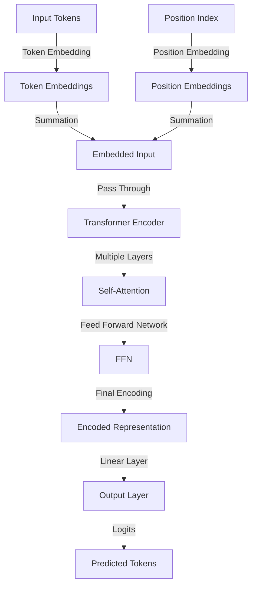
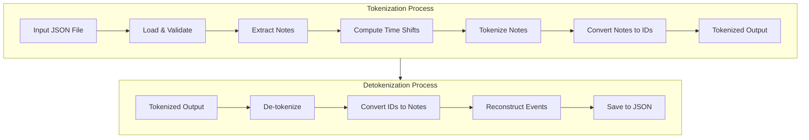
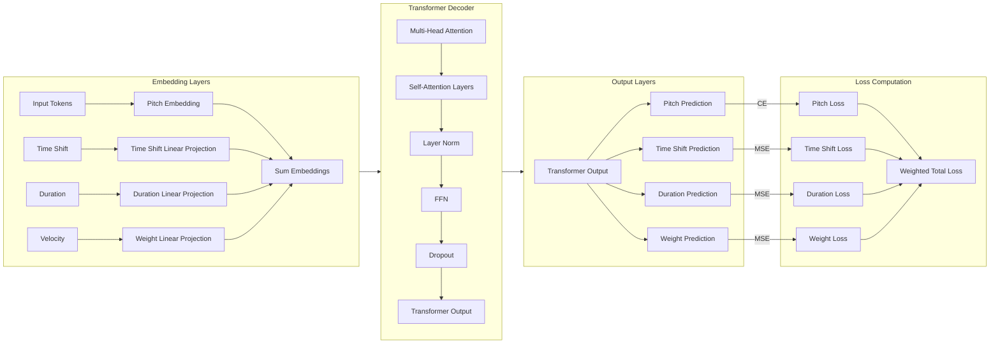
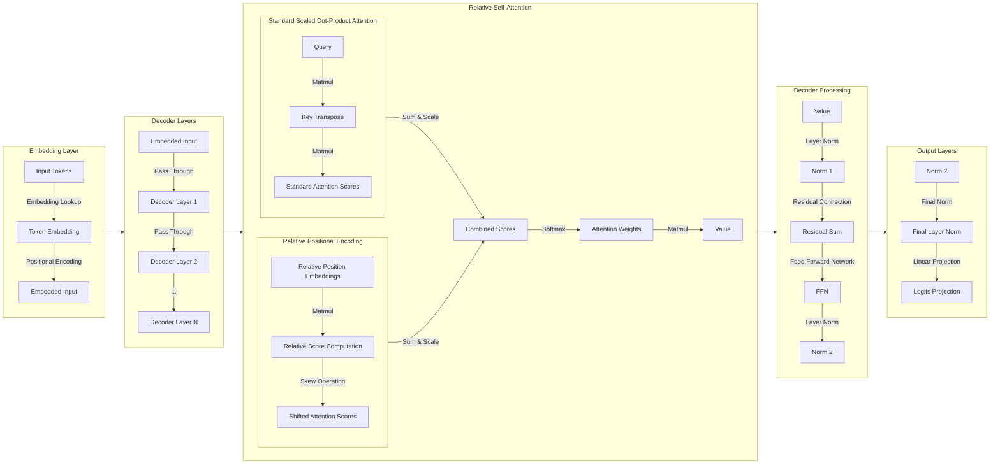

---
# You can also start simply with 'default'
theme: seriph
background: "public/images/cover.webp"
# some information about your slides (markdown enabled)
title: "PianoGen: Generacion de Musica de Piano con IA"
info: |
  ## Slidev Starter Template
  Presentation slides for developers.

  Learn more at [Sli.dev](https://sli.dev)
# apply unocss classes to the current slide
class: text-center
# https://sli.dev/features/drawing
drawings:
  persist: false
# slide transition: https://sli.dev/guide/animations.html#slide-transitions
transition: slide-left
mdc: true
setup:
  # import ReactiveMidiPlayer from 'components/ReactiveMidiPlayer.vue';
  import MidiPlayer from 'components/MidiPlayer.vue';
  import LinkButton from 'components/LinkButton.vue';
  import 'setup/main.js';
hideInToc: true
---


# PianoGen: Generacion de Musica de Piano con IA
Aplicando Transformers.

<div class="abs-br m-6 text-xl">
  Federico Williamson <a href="https://github.com/MightyHelper/pianogen" target="_blank" class="slidev-icon-btn">
    <carbon:logo-github />
  </a>
</div>


---
title: Contenidos
layout: image-left
image: "public/images/cover.webp"
hideInToc: true
---
# Contenidos
<Transform :scale=1>
<Toc maxDepth=1 />
</Transform>

---
transition: fade-out
title: "Qué es una canción?"
---

# Qué es una canción?

## MIDI

<v-clicks>

- 🎵 **Mensajes de Nota** – Eventos de nota-on/off, tono, velocidad, duración.  
- 🎚️ **Mensajes de Control Change (CC)** – Ajusta volumen, modulación, expresión.  
- 🎛️ **Cambio de Programa** – Cambia sonidos o patches de instrumento.  
- ⏳ **Tiempo & Sincronización** – Tempo, firmas de tiempo, sincronización.  
- 🔧 **Mensajes de Sistema** – Metadatos, posición de la canción, datos SysEx.  

</v-clicks>

<!-- <center> -->

{width=65%}

<!-- </center> -->

---
---
# Datasets
<v-clicks>

- Custom
- Maestro
- JSB
- Lakh?

</v-clicks>

---
---
## Ejemplo Maestro

<MidiPlayer midi-path="/saved_outputs/maestro_samples/MIDI-Unprocessed_R1_D1-1-8_mid--AUDIO-from_mp3_01_R1_2015_wav--5.midi" />

---
---
## Ejemplo custom

<MidiPlayer midi-path="/saved_outputs/custom_samples/midi_undefined_1715486929603.mid" />
---
---

## Ejemplo JSB

<MidiPlayer midi-path="/saved_outputs/jsb_samples/000000.mid" />
---
---

## Comparación de tamaño de datasets

<!-- <center> -->

{border=rounded}

<!-- </center> -->

---
---
## Comparación de uso de notas

<!-- <center> -->

{width=85%, border=rounded}

<!-- </center> -->

---
---
## Comparación de duración de notas

<!-- <center> -->

{border=rounded}

<!-- </center> -->

---
---
# Tokenización para música
Cómo tokenizamos musica?
<!-- TODO: Image piano roll + Arrow + token ids + question mark -->

<v-clicks depth=2>

- MidiTok (REMI) 
  - 
- CrayKH (Texto)
  - 

</v-clicks>

---
---
<v-clicks depth=2>

- JSB
  - 
- Tokenización continua?

</v-clicks>

---
layout: center
---

# Experimentos

---
layout: two-cols-header
---

## V1: Primeros experimentos
<!-- TODO: Explain TFModel and it's shortcomings -->
<!-- Explain that training did not give good results. No need to listen - show empty piano roll -->
::left::

<Transform :scale=0.4>



</Transform>


::right::

<v-clicks>

- Tokenizador: `REMI`
- Arquitectura transformer básica
- Encoder-only
- ```yaml
  vocab_size: 3000
  embed_size: 512
  num_heads: 8
  num_layers: 6
  ff_hidden_size: 2048
  max_seq_length: 512
  dropout: 0.1
  ```
- No tuvo muy buenos resultados
- Complejidad del tokenizador?

</v-clicks>

---
---

## V2: Mejor Configuración de REMI
<!-- Explain the ehnanced tokenization. Why BPE is not good. -->
<!-- Show result after 30 minutes of training -->
<!-- saved_outputs/v2/v2-best.mid -->

<v-clicks>

- Mismo modelo que V1
- Tokenizador sin BPE
- Resultados con 30 minutos de entrenamiento; loss = 0.01

</v-clicks>

<v-switch unmount>
<template #1> <MidiPlayer midi-path="/saved_outputs/v2/v2-best.mid" height=35vh /> </template>
</v-switch>
---
---

## V3: GPT-2

<!-- Explain why experiment with GPT-2 -->
<!-- Talk about HF Trainer API -->
<!-- Talk about overfitting and dataset contamination -->

<v-clicks>

- Modelo GPT-2
- Loop de entrenamiento con HF Trainer API
- Pre-Chunking para batching
- Overfitting y contaminación del dataset!
</v-clicks>
<v-switch unmount>
  <template #1 > <MidiPlayer midi-path="/saved_outputs/v3/v3-try-1.mid" height=30vh /> </template>
  <template #2 > <MidiPlayer midi-path="/saved_outputs/v3/v3-try-2-more-train.mid" height=30vh /> </template>
  <template #3 > <MidiPlayer midi-path="/saved_outputs/v3/v3-try3-more-training.mid" height=30vh /> </template>
</v-switch>
---
---

## V4: Más Datos y augmentación
<!-- Experimented with different datasets, multiple training resumes from checkpoints -->

<!-- Show some of the results -->

<v-clicks>

- Denuevo con GPT-2
- Experimentando con diferentes datasets
- Resumiendo muchas veces de un checkpoint anterior
- Explorando augmentacion $\leftarrow$ Mas contaminación!

</v-clicks>

<v-switch unmount>
  <template #1 > <MidiPlayer midi-path="/saved_outputs/v4/01-lahk/v4-lahk.mid" height=30vh /> </template>
  <template #2 > <MidiPlayer midi-path="/saved_outputs/v4/02-manual/v4-1-manual.mid" height=30vh /> </template>
  <template #3 > <MidiPlayer midi-path="/saved_outputs/v4/02-manual/v4-1-manual-1.mid" height=30vh /> </template>
  <template #4 > <MidiPlayer midi-path="/saved_outputs/v4/02-manual/v4-1-manual-2.mid" height=30vh /> </template>
  <template #5 > <MidiPlayer midi-path="/saved_outputs/v4/02-manual/v4-1-manual-3.mid" height=30vh /> </template>
  <template #6 > <MidiPlayer midi-path="/saved_outputs/v4/02-manual/v4-1-manual-b-1.mid" height=30vh /> </template>
  <template #7 > <MidiPlayer midi-path="/saved_outputs/v4/02-manual/v4-1-manual-b-2.mid" height=30vh /> </template>
  <template #8 > <MidiPlayer midi-path="/saved_outputs/v4/02-manual/v4-1-manual-b-3.mid" height=30vh /> </template>
  <template #9 > <MidiPlayer midi-path="/saved_outputs/v4/02-manual/v4-1-manual-b-4.mid" height=30vh /> </template>
  <template #10 > <MidiPlayer midi-path="/saved_outputs/v4/03-larger/1-of-1.mid" height=30vh /> </template>
  <template #11 > <MidiPlayer midi-path="/saved_outputs/v4/03-larger/1-of-2.mid" height=30vh /> </template>
  <template #12 > <MidiPlayer midi-path="/saved_outputs/v4/03-larger/1-of-3.mid" height=30vh /> </template>
  <template #13 > <MidiPlayer midi-path="/saved_outputs/v4/03-larger/1-of-4.mid" height=30vh /> </template>
  <template #14 > <MidiPlayer midi-path="/saved_outputs/v4/03-larger/1-of-5.mid" height=30vh /> </template>
  <template #15 > <MidiPlayer midi-path="/saved_outputs/v4/04-slow-train/generated.mid" height=30vh /> </template>
</v-switch>

---
---

## Problemas de la Tokenizacion `REMI`
<v-clicks>

- Token Embedding + Positional? Embedding
- Duración?
- Volumen?
- Orden de notas en un acorde?

</v-clicks>

---
---
## V5: Tokenización Continua

Tomamos los eventos de midi y los traducimos al siguiente formato:
```yaml
time_shift: float (ms)
velocity  : float (0-1)
note      : int
duration  : float (ms)
```

<Transform :scale=1>



</Transform>

<!-- Explain the perceived problems with previous attempts. -->
<!-- Explain Continous tokenization -->
<!-- Show model diagram -->
<!-- Explain Results -->

---
---

### V5: Arquitectura
<Transform :scale=1>


</Transform>

<v-clicks>

- Los resultados no fueron buenos: Siempre predecia silencio o time shifts negativos
- Posiblemente la funcion objetivo estaba mal definida
- Posiblemente faltó mayor tiempo de entrenamiento

</v-clicks>

---
---

## V6: Tokenización CrayKH
<v-clicks>

- La complejidad del modelo anterior no funcionó
- Simplificamos el modelo a lo mas simple posible

- Lo habia visto funcionando
- Despues volvemos a los resultados

</v-clicks>
<!-- Explain why CrayKH -->
<!-- It seemed to work for them; + Simplicity -->

---
---

## V7: MusicTransformer & Atención Relativa

<!-- Explain the MusicTransformer architecture -->

<v-clicks>

- Como baseline estaba usando el Paper de MusicTransformer.
- El modelo de Relative Self Attention permite reducir el la complejidad espacial de cuadrática a lineal poniendo una cota superior en la distancia de atención.

</v-clicks>

---
---
<Transform :scale=1>


</Transform>

---
---

# Resultados

<!-- Explain the premise: we need comparable results -->
<!-- Explain why no V5 and no TF Model -->

<!-- Show results -->


<style>
.slidev-table {
  border-collapse: collapse;
  margin: 0 auto;
  font-size: 10px;
  table-layout: fixed;
  width: 100%;
}
.slidev-table th {
  background: #f5f5f555;
  padding: 4px 2px;
  border-bottom: 2px solid #ddd;
  white-space: nowrap;
  text-align: center;
}
.slidev-table td {
  padding: 3px 2px;
  border-bottom: 1px solid #eee;
  text-align: center;
}
.link-cell {
  width: 40px; /* Fixed width for link column */
}
.footnote {
  font-size: 8px;
  color: #666;
  margin-top: 8px;
}
</style>

<table class="slidev-table">
<thead><tr>
<th>Modelo</th>
<th>Tokenizador</th>
<th>Dataset</th>
<th>Output</th>
<th>Contexto</th>
<th>#Cabezas</th>
<th>Embed</th>
<th>#Capas</th>
<th>Params(M)</th>
<th>Tiempo(s)</th>
<th>Mem(MB)</th>
<th>Perplejidad</th>
<th>NLLLoss</th>
</tr></thead>
<tbody>
<tr><td>gpt2</td><td>remi</td><td>maestro</td><td class="link-cell"><LinkButton query='saved_outputs/nan' slide=25 /><a href='https://wandb.ai/federicowilliamson/pianogen/runs/mzhwcl7o'>📈</a></td><td>512</td><td>8</td><td>512</td><td>6</td><td>19.2</td><td>4280</td><td>nan</td><td>3.6813</td><td style="background: #f0f0f044; color: rgb(255,0,0)">1.3033</td></tr>
<tr><td>gpt2</td><td>remi</td><td>maestro</td><td class="link-cell"><LinkButton query='saved_outputs/gpt2/remi_nbpe/Train[maestro]_Test[maestro]_Val[maestro].03.02.25.c/sample_output.mid' slide=25 /><a href='https://wandb.ai/federicowilliamson/pianogen/runs/dxkw4nq5'>📈</a></td><td>512</td><td>8</td><td>1024</td><td>8</td><td>101.4</td><td>5831</td><td>6700</td><td>3.6331</td><td style="background: #f0f0f044; color: rgb(252,2,0)">1.2901</td></tr>
<tr><td>gpt2</td><td>remi</td><td>maestro</td><td class="link-cell"><LinkButton query='saved_outputs/gpt2/remi_nbpe/Train[maestro]_Test[maestro]_Val[maestro].04.02.25/sample_output.mid' slide=25 /><a href='https://wandb.ai/federicowilliamson/pianogen/runs/euwsqg6v'>📈</a></td><td>1024</td><td>16</td><td>1024</td><td>16</td><td>202.7</td><td>13813</td><td>7299</td><td>3.5618</td><td style="background: #f0f0f044; color: rgb(247,7,0)">1.2703</td></tr>
<tr><td>gpt2</td><td>remi</td><td>jsb</td><td class="link-cell"><LinkButton query='saved_outputs/gpt2/remi_nbpe/Train[jsb_chorales]_Test[jsb_chorales]_Val[jsb_chorales].05.02.25.b/sample_output.mid' slide=25 /><a href='https://wandb.ai/federicowilliamson/pianogen/runs/m1z5nhpx'>📈</a></td><td>1024</td><td>16</td><td>1024</td><td>16</td><td>202.7</td><td>1431</td><td>7399</td><td>2.7728</td><td style="background: #f0f0f044; color: rgb(192,62,0)">1.0199</td></tr>
<tr><td>gpt2</td><td>remi</td><td>jsb</td><td class="link-cell"><LinkButton query='saved_outputs/gpt2/remi_nbpe/Train[jsb_chorales]_Test[jsb_chorales]_Val[jsb_chorales].05.02.25.c/sample_output.mid' slide=25 /><a href='https://wandb.ai/federicowilliamson/pianogen/runs/ede3at2o'>📈</a></td><td>1024</td><td>16</td><td>1024</td><td>16</td><td>202.7</td><td>4322</td><td>7400</td><td>2.1106</td><td style="background: #f0f0f044; color: rgb(131,123,0)">0.7470</td></tr>
<tr><td>gpt2</td><td>craykh</td><td>jsb</td><td class="link-cell"><LinkButton query='saved_outputs/gpt2/craykh_nbpe/Train[jsb_chorales]_Test[jsb_chorales]_Val[jsb_chorales]/sample_output.mid' slide=25 /><a href='https://wandb.ai/federicowilliamson/pianogen/runs/vc6pefsh'>📈</a></td><td>1024</td><td>16</td><td>1024</td><td>16</td><td>202.7</td><td>2971</td><td>7397</td><td>1.1635</td><td style="background: #f0f0f044; color: rgb(0,255,0)">0.1514</td></tr>
<tr><td>gpt2</td><td>craykh</td><td>jsb_fast</td><td class="link-cell"><LinkButton query='saved_outputs/gpt2/craykh_nbpe/Train[jsb_chorales_fast]_Test[jsb_chorales_fast]_Val[jsb_chorales_fast]/sample_output.mid' slide=25 /><a href='https://wandb.ai/federicowilliamson/pianogen/runs/9j942gzy'>📈</a></td><td>1024</td><td>16</td><td>1024</td><td>16</td><td>202.7</td><td>1924</td><td>7401</td><td>1.5502</td><td style="background: #f0f0f044; color: rgb(63,191,0)">0.4384</td></tr>
<tr><td>mt</td><td>craykh</td><td>jsb_fast</td><td class="link-cell"><LinkButton query='saved_outputs/music_transformer/craykh_nbpe/Train[jsb_chorales_fast]_Test[jsb_chorales_fast]_Val[jsb_chorales_fast].06.02.25/sample_output.mid' slide=25 /><a href='https://wandb.ai/federicowilliamson/pianogen/runs/505hiyob'>📈</a></td><td>1024</td><td>16</td><td>1024</td><td>16</td><td>25.3</td><td>702</td><td>1985</td><td>1.4409</td><td style="background: #f0f0f044; color: rgb(47,207,0)">0.3652</td></tr>
<tr><td>mt</td><td>craykh</td><td>jsb_fast</td><td class="link-cell"><LinkButton query='saved_outputs/music_transformer/craykh_nbpe/Train[jsb_chorales_fast]_Test[jsb_chorales_fast]_Val[jsb_chorales_fast].06.02.25/sample_output.mid' slide=25 /><a href='https://wandb.ai/federicowilliamson/pianogen/runs/stc88ynm'>📈</a></td><td>1024</td><td>16</td><td>1024</td><td>16</td><td>25.3</td><td>766</td><td>1985</td><td>1.4202</td><td style="background: #f0f0f044; color: rgb(44,210,0)">0.3508</td></tr>
<tr><td>mt</td><td>craykh</td><td>jsb+custom</td><td class="link-cell"><LinkButton query='saved_outputs/nan' slide=25 /><a href='https://wandb.ai/federicowilliamson/pianogen/runs/nvap2o44'>📈</a></td><td>1024</td><td>16</td><td>1024</td><td>16</td><td>25.3</td><td>2385</td><td>nan</td><td>1.2668</td><td style="background: #f0f0f044; color: rgb(18,236,0)">0.2365</td></tr>
<tr><td>mt</td><td>craykh</td><td>jsb+custom</td><td class="link-cell"><LinkButton query='saved_outputs/music_transformer/craykh_nbpe/Train[jsb_chorales.custom]_Test[jsb_chorales.custom]_Val[jsb_chorales.custom].07.02.25/sample_output.mid' slide=25 /><a href='https://wandb.ai/federicowilliamson/pianogen/runs/u9qlrn05'>📈</a></td><td>2024</td><td>16</td><td>1024</td><td>16</td><td>25.3</td><td>6564</td><td>5961</td><td>1.2218</td><td style="background: #f0f0f044; color: rgb(10,244,0)">0.2003</td></tr>
<tr><td>mt</td><td>jsb</td><td>jsb_fast</td><td class="link-cell"><LinkButton query='saved_outputs/music_transformer/jsb/Train[jsb_chorales_fast]_Test[jsb_chorales_fast]_Val[jsb_chorales_fast].09.02.25.a/sample_output.mid' slide=25 /><a href='https://wandb.ai/federicowilliamson/pianogen/runs/tnpgvr8q'>📈</a></td><td>2024</td><td>16</td><td>1024</td><td>16</td><td>25.3</td><td>1747</td><td>5960</td><td>1.2671</td><td style="background: #f0f0f044; color: rgb(18,236,0)">0.2368</td></tr>
<tr><td>gpt2</td><td>jsb</td><td>jsb_fast</td><td class="link-cell"><LinkButton query='saved_outputs/gpt2/jsb/Train[jsb_chorales_fast]_Test[jsb_chorales_fast]_Val[jsb_chorales_fast]/sample_output.mid' slide=25 /><a href='https://wandb.ai/federicowilliamson/pianogen/runs/1cafolb4'>📈</a></td><td>1024</td><td>16</td><td>1024</td><td>16</td><td>202.6</td><td>2686</td><td>7396</td><td>1.4703</td><td style="background: #f0f0f044; color: rgb(51,203,0)">0.3854</td></tr>
<tr><td>gpt2</td><td>jsb</td><td>jsb_fast</td><td class="link-cell"><LinkButton query='saved_outputs/gpt2/jsb/Train[jsb_chorales_fast]_Test[jsb_chorales_fast]_Val[jsb_chorales_fast].small/sample_output.mid' slide=25 /><a href='https://wandb.ai/federicowilliamson/pianogen/runs/l1wwlloh'>📈</a></td><td>512</td><td>8</td><td>512</td><td>5</td><td>16.0</td><td>467</td><td>7026</td><td>1.5544</td><td style="background: #f0f0f044; color: rgb(64,190,0)">0.4411</td></tr>
<tr><td>mt</td><td>jsb</td><td>jsb_fast</td><td class="link-cell"><LinkButton query='saved_outputs/music_transformer/jsb/Train[jsb_chorales_fast]_Test[jsb_chorales_fast]_Val[jsb_chorales_fast].small/sample_output.mid' slide=25 /><a href='https://wandb.ai/federicowilliamson/pianogen/runs/yqtq5a2z'>📈</a></td><td>512</td><td>8</td><td>512</td><td>5</td><td>25.3</td><td>886</td><td>5508</td><td>1.4757</td><td style="background: #f0f0f044; color: rgb(52,202,0)">0.3891</td></tr>
<tr>
<td>mt†</td>
<td>jsb</td>
<td>jsb_fast</td>
<td class="link-cell"><a href="https://arxiv.org/abs/1809.04281v3">📖</a></td>
<td>512</td>
<td>8</td>
<td>512</td>
<td>5</td>
<td>??</td>
<td>??</td>
<td>??</td>
<td>1.4290</td>
<td style="background: #f0f0f044; color: rgb(45,209,0)">0.357</td>
</tr>
</tbody></table>

<div class="footnote">
† Valores de @huang2018music (Relative Transformer Baseline)
</div>


---
---


<ReactiveMidiPlayer/>

<!--   ---
  layout: iframe
  url: "https://wandb.ai/federicowilliamson/pianogen/workspace/"
  --- -->

---
---

# Conclusiones
<v-clicks>

- La **tokenización** es clave.  _Ajustes en vocabulario y eventos mejoraron la representación._
- Se identificaron desafíos técnicos como **overfitting** y **contaminación** de datos. 
- El **almacenamiento** es un factor crítico debido a la gran cantidad de modelos generados.
- No existen **métricas** claras y **comparables** entre diferentes esquemas de tokenización.

</v-clicks>

# Trabajo Futuro
<v-clicks>

- Explorar modelos **multimodales** combinando partituras visuales o audio.
- Ampliar experimentos de **augmentación** de datos.  
- Incorporar **pedales y velocidad** para mejorar la calidad musical generada.

</v-clicks>


---
---

# Fin
<iframe width="100%" height="166" scrolling="no" frameborder="no" allow="autoplay" src="https://w.soundcloud.com/player/?url=https%3A//api.soundcloud.com/tracks/1822951494&color=%23ff5500&auto_play=false&hide_related=true&show_comments=false&show_user=false&show_reposts=false&show_teaser=false"></iframe><div style="font-size: 10px; color: #cccccc;line-break: anywhere;word-break: normal;overflow: hidden;white-space: nowrap;text-overflow: ellipsis; font-family: Interstate,Lucida Grande,Lucida Sans Unicode,Lucida Sans,Garuda,Verdana,Tahoma,sans-serif;font-weight: 100;"><a href="https://soundcloud.com/mighty_helper" title="Mighty Helper" target="_blank" style="color: #cccccc; text-decoration: none;">Mighty Helper</a> · <a href="https://soundcloud.com/mighty_helper/random-improvs-yama00" title="Random Improvs - Yama00" target="_blank" style="color: #cccccc; text-decoration: none;">Random Improvs - Yama00</a></div>

